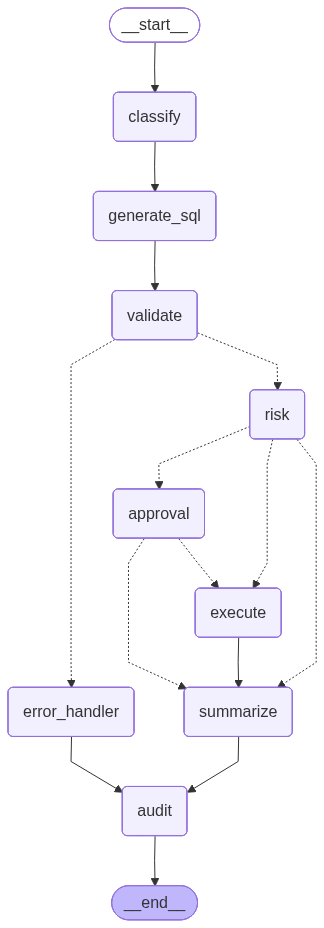

# 🛡️ SafeSQL-MCP

**A LangGraph-powered MCP server for natural language SQL with human-in-the-loop approval for database write operations.**

[](https://www.python.org/downloads/)
[](https://github.com/langchain-ai/langgraph)
[](https://gofastmcp.com)
[](LICENSE)

---

## 📖 About

SafeSQL-MCP is an AI-powered database operations assistant that lets users interact with databases using natural language. It translates questions into SQL, classifies risk, and enforces human approval for destructive operations — exactly how enterprise copilots are built.

**Think of it as an operations analyst talking to the database:**

```
User: "Show me the top 10 customers by revenue."
→ Executes immediately.

User: "Increase product price by 5% for beverages."
→ Generates SQL → Analyzes risk → Waits for human approval → Executes.

User: "Drop the customers table."
→ BLOCKED. Refused entirely.
```

---

## ✨ Features

- 🧠 **Natural Language to SQL** — Ask questions in plain English, get accurate SQL
- 🛡️ **Safety Layer** — Automatic risk classification (SAFE / LOW / MEDIUM / HIGH / BLOCKED)
- 👤 **Human-in-the-Loop** — LangGraph interrupt/resume for write operation approval
- 🔍 **Dry Run** — Preview row impact before executing destructive queries
- 📝 **Full Audit Trail** — Every operation logged with timestamp, user, SQL, and result
- 🔄 **Multi-turn Conversations** — Context-aware follow-up questions
- 🌐 **MCP Server** — Expose tools via SSE for any MCP-compatible client
- 💻 **CLI Agent** — Interactive terminal interface
- 🖥️ **Streamlit UI** — Professional web interface with approval workflow
- 🏠 **100% Local** — Runs entirely on your machine with Ollama (no API keys needed)

---

## 🏗️ Architecture

```
┌─────────────────┐              ┌──────────────────┐
│  Streamlit UI   │──── SSE ────▶│                  │
└─────────────────┘              │   MCP Server     │
                                 │   (FastMCP)      │
┌─────────────────┐              │                  │
│   CLI Agent     │──── SSE ────▶│   Port 8100      │
└─────────────────┘              │   /mcp endpoint  │
                                 └────────┬─────────┘
┌─────────────────┐                       │
│  MCP Clients    │──── SSE ────▶         │
│  (Cursor/Claude)│                       ▼
└─────────────────┘              ┌──────────────────┐
                                 │  LangGraph Agent  │
                                 │                  │
                                 │  classify → generate_sql → validate
                                 │     → risk → [approval] → execute
                                 │     → summarize → audit            │
                                 └──────────────────┘
```

### LangGraph Flow



| Scenario | Path |
|----------|------|
| **READ** (SELECT) | classify → generate_sql → validate → risk (SAFE) → execute → summarize → audit |
| **WRITE** (UPDATE/DELETE) | classify → generate_sql → validate → risk → ⏸ approval → execute → summarize → audit |
| **LOW RISK** (INSERT) | classify → generate_sql → validate → risk (LOW) → execute → summarize → audit |
| **BLOCKED** (DROP/TRUNCATE) | classify → generate_sql → validate → ❌ blocked → error_handler → audit |
| **REJECTED** | classify → generate_sql → validate → risk → ⏸ approval → ❌ rejected → summarize → audit |

---

## 🛠️ Tech Stack

| Component | Technology |
|-----------|-----------|
| **AI Agent** | LangGraph + LangChain |
| **LLM** | Ollama (local, open-source models) |
| **Model** | qwen2.5-coder:7b-instruct (configurable) |
| **MCP Server** | FastMCP 3.4+ (streamable-http) |
| **Database** | SQLite (Northwind sample DB) |
| **Audit** | Separate SQLite database |
| **Web UI** | Streamlit |
| **Logging** | pyLoggerX (rotating file + console) |
| **SQL Parsing** | sqlparse |

---

## 📁 Project Structure

```
SafeSQL-MCP/
│
├── app.py                  # Main entry point (CLI / MCP server / HTTP server)
├── server.py               # FastMCP server with all exposed tools
├── graph.py                # LangGraph agent assembly + routing
├── state.py                # Agent state definition (TypedDict)
├── config.py               # All configuration (LLM, DB, risk thresholds)
├── db.py                   # Database connections (Northwind + Audit)
├── streamlit_app.py        # Streamlit web UI
│
├── nodes/                  # LangGraph nodes (one function per node)
│   ├── classify.py         # Intent detection (SELECT/UPDATE/DELETE/DDL/UNSAFE)
│   ├── generate_sql.py     # Natural language → SQL generation
│   ├── validate.py         # SQL safety validation + BLOCKED detection
│   ├── risk.py             # Risk level assignment
│   ├── approval.py         # Human-in-the-loop interrupt/resume
│   ├── execute.py          # Dry run + SQL execution with timing
│   ├── summarize.py        # Result → natural language response
│   └── error_handler.py    # Error state management
│
├── tools/                  # Utility functions (used by nodes + MCP)
│   ├── schema.py           # list_tables, get_schema, describe_table
│   ├── query.py            # query_database, explain_query
│   ├── write.py            # run_sql, preview_update
│   ├── approval.py         # approve/reject operations, expiry check
│   ├── audit.py            # log_execution, get_execution_history
│   └── rollback.py         # rollback_transaction, execute_with_rollback
│
├── prompts/                # LLM prompt templates
│   ├── classify.txt        # Intent classification prompt
│   ├── generate_sql.txt    # SQL generation prompt (with schema)
│   └── summarize.txt       # Result summarization prompt
│
├── logger/                 # Logging module (pyLoggerX)
│   ├── __init__.py
│   ├── config.py
│   └── custom_logger.py
│
├── database/               # SQLite databases
│   ├── northwind.db        # Sample database (Northwind)
│   └── audit.db            # Audit trail (auto-created)
│
├── Logs/                   # Application logs (auto-created)
│
├── diagram.png             # LangGraph flow diagram
├── graph_diagram.md        # Mermaid diagram source
├── requirements.txt        # Python dependencies
└── README.md               # This file
```

---

## 🚀 Installation

### Prerequisites

- Python 3.10+
- [Ollama](https://ollama.ai/) installed and running

### 1. Clone the repository

```bash
git clone https://github.com/yourusername/SafeSQL-MCP.git
cd SafeSQL-MCP
```

### 2. Create virtual environment

```bash
python -m venv venv
source venv/bin/activate        # Linux/macOS
# or
venv\Scripts\activate           # Windows
```

### 3. Install dependencies

```bash
pip install -r requirements.txt
```

### 4. Pull the LLM model

```bash
ollama pull qwen2.5-coder:7b-instruct-q5_K_M
```

### 5. Verify installation

```bash
python app.py --health
```

Expected output:
```
──────────────────────────────────────────────────
  SQL AI Agent - Health Check
──────────────────────────────────────────────────
  ✓ northwind_db         OK (9 tables)
  ✓ audit_db             OK
  ✓ llm                  OK (qwen2.5-coder:7b-instruct-q5_K_M)
  ✓ langgraph            OK (graph compiled)
──────────────────────────────────────────────────
```

---

## ⚙️ Configuration

All settings are in `config.py`:

```python
# LLM
OLLAMA_BASE_URL = "http://localhost:11434"
MODEL_NAME = "qwen2.5-coder:7b-instruct-q5_K_M"

# Risk Thresholds
RISK_LEVELS = {
    "SELECT":   "SAFE",       # Execute immediately
    "INSERT":   "LOW",        # Execute with dry run
    "UPDATE":   "MEDIUM",     # Requires approval
    "DELETE":   "HIGH",       # Requires approval
    "ALTER":    "HIGH",       # Requires approval
    "DROP":     "BLOCKED",    # Refused entirely
    "TRUNCATE": "BLOCKED",    # Refused entirely
}

# Approval
APPROVAL_EXPIRY_SECONDS = 300   # 5 minutes

# Dry Run
DRY_RUN_ENABLED = True          # COUNT(*) before write ops
```

---

## 📖 Usage

### Option 1: MCP Server + Streamlit UI

**Terminal 1** — Start the MCP server:
```bash
python app.py --mode http
```

**Terminal 2** — Launch Streamlit:
```bash
streamlit run streamlit_app.py
```

### Option 2: MCP Server + CLI Agent

**Terminal 1** — Start the MCP server:
```bash
python app.py --mode http
```

**Terminal 2** — Launch CLI:
```bash
python app.py --mode cli
```

### Option 3: MCP Server for External Clients (Cursor, Claude, etc.)

```bash
python app.py --mode mcp
```

This starts the server in stdio mode for MCP-compatible clients.

### CLI Commands

| Command | Description |
|---------|-------------|
| *any text* | Ask a natural language question |
| `/tables` | List all database tables |
| `/schema <table>` | Show table schema |
| `/explain <sql>` | Explain SQL in plain English |
| `/preview <sql>` | Preview write operation impact |
| `/history` | View audit logs |
| `/approve` | Approve pending operation |
| `/reject` | Reject pending operation |
| `/status` | Show agent status |
| `/clear` | Clear conversation history |
| `/help` | Show help |
| `/quit` | Exit |

### MCP Tools (exposed via server)

| Tool | Description |
|------|-------------|
| `ask_database` | Natural language query (full agent pipeline) |
| `approve_operation` | Approve a pending write operation |
| `reject_operation` | Reject a pending write operation |
| `get_tables` | List all database tables |
| `get_database_schema` | Get table DDL |
| `describe_database_table` | Detailed table info |
| `run_read_query` | Execute raw SELECT |
| `explain_sql` | Explain SQL in English |
| `preview_write_operation` | Dry run a write query |
| `get_audit_logs` | View execution history |

---

## 🔒 Safety Model

```
┌─────────────┬──────────────┬─────────────────────────────────┐
│ Operation   │ Risk Level   │ Behavior                        │
├─────────────┼──────────────┼─────────────────────────────────┤
│ SELECT      │ SAFE         │ Execute immediately             │
│ INSERT      │ LOW          │ Dry run → Execute               │
│ UPDATE      │ MEDIUM       │ Dry run → Approval → Execute    │
│ DELETE      │ HIGH         │ Dry run → Approval → Execute    │
│ ALTER       │ HIGH         │ Dry run → Approval → Execute    │
│ DROP        │ BLOCKED      │ Refused entirely                │
│ TRUNCATE    │ BLOCKED      │ Refused entirely                │
└─────────────┴──────────────┴─────────────────────────────────┘
```

**Additional safety features:**
- Approval tokens expire after 5 minutes
- Every operation is logged to a separate audit database
- Dry run (COUNT) before any write operation
- SQL parsing and validation before execution
- Rollback support for failed transactions

---

## 📊 Audit Trail

Every operation is recorded in `database/audit.db`:

| Field | Description |
|-------|-------------|
| `user_question` | Original natural language question |
| `generated_sql` | SQL that was generated |
| `operation_type` | SELECT / UPDATE / DELETE / etc. |
| `risk_level` | SAFE / LOW / MEDIUM / HIGH / BLOCKED |
| `approved_by` | Who approved (if applicable) |
| `rows_affected` | Number of rows impacted |
| `execution_time_ms` | Query execution time |
| `status` | SUCCESS / ERROR |
| `timestamp` | When it happened |

---

## 📝 Notes

- The project uses **Northwind** sample database (SQLite) for demonstration
- All LLM inference runs **locally** via Ollama — no data leaves your machine
- The MCP server maintains state between calls, enabling the approval workflow
- Prompt templates are stored in `/prompts/` as plain text files for easy customization
- The logger writes to both console and rotating log files in `/Logs/`
- You can swap the LLM model by changing `MODEL_NAME` in `config.py`
- The project follows a **functions-first** approach (no classes except StateGraph and MCP server)

---

## 🤝 Contributing

Contributions to this project are welcome! If you have ideas for improvements, bug fixes, or new features, feel free to open an issue or submit a pull request.

1. Fork the repository
2. Create your feature branch (`git checkout -b feature/amazing-feature`)
3. Commit your changes (`git commit -m 'Add amazing feature'`)
4. Push to the branch (`git push origin feature/amazing-feature`)
5. Open a Pull Request

---

## 📄 License

This project is licensed under the MIT License - see the [MIT License](LICENSE) file for details.

---

<p align="center">
  <b>SafeSQL-MCP</b> — Talk to your database safely. 🛡️
</p>
