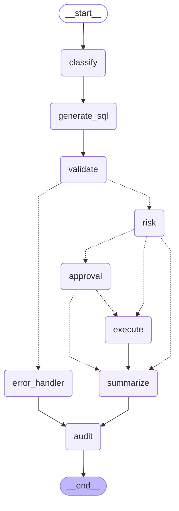

# SQL AI Agent - LangGraph Flow

## Flow Legend

- **Solid lines** (`-->`) = always follows this path
- **Dashed lines** (`-.->`) = conditional routing

## Paths

| Scenario                   | Path                                                                                                      |
| -------------------------- | --------------------------------------------------------------------------------------------------------- |
| READ (SAFE)                | start → classify → generate_sql → validate → risk → execute → summarize → audit → end             |
| WRITE (MEDIUM/HIGH)        | start → classify → generate_sql → validate → risk → approval → execute → summarize → audit → end |
| WRITE (LOW)                | start → classify → generate_sql → validate → risk → execute → summarize → audit → end             |
| BLOCKED (DROP/TRUNCATE)    | start → classify → generate_sql → validate → error_handler → audit → end                            |
| BLOCKED (at risk)          | start → classify → generate_sql → validate → risk → summarize → audit → end                        |
| REJECTED (approval denied) | start → classify → generate_sql → validate → risk → approval → summarize → audit → end            |
